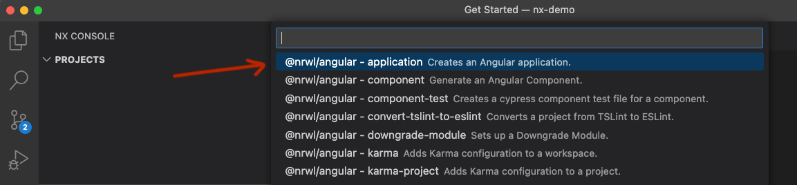
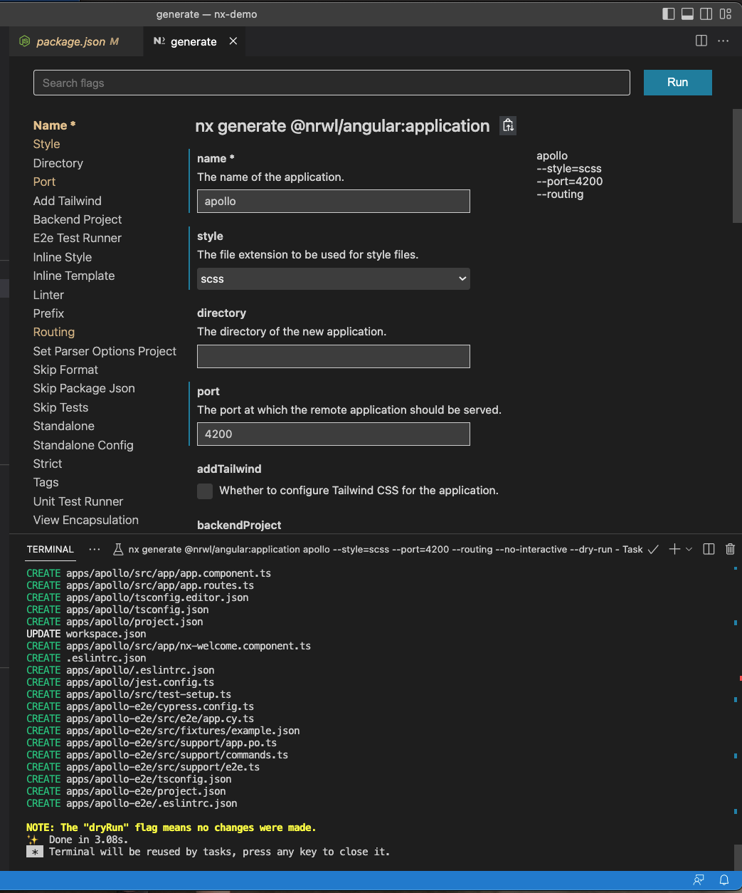

# NX

NX is a mono repo. It's main advantage is that developers can have multiple Angular projects and libraries.
For Cirrus Approach, the Courses, Recent-Activity and upcoming Instructor Dashboard make use of common components and data structures.
This is why we have a Models library, a UI library, Global SideNav and Global Header library, and a Notifications' library.

## Documentation

NX documentation specific to Angular can be found [here](https://nx.dev/getting-started/angular-standalone-tutorial).

## Pro Tips

- **Plugins** Use the NX Console plugin for VSCode or WebStorm. Makes your life a lot easier. This is how nearly 100% of the components were created.
  - When using the NX Console to generate a component, especially in a library such as the UI library. The NX console (via Angular Schematics will automatically declare )

---

## Creating an nx repo

`npx create-nx-workspace --packageManager yarn`

Give the workspace a name. In this example I gave it a name of nx-demo

You are prompted for type of workspace - select apps.


Say no to Nx Cloud.

##Setting up the Angular plugin
Adding the Angular plugin to an existing Nx workspace can be done with the following:

`yarn add -D @nx/angular`

`npm install -D @nx/angular`

_We've used YARN with Cirrus_

> Unhappy about this, but I had to run `nx migrate next`, delete the node_modules directory and run yarn to reinstall all the npm packages before I could generate the angular application.

##Using the Angular Plugin: Creating a project within the MonoRepo

It's straightforward to generate an Angular application:

`nx g @nx/angular:app appName`

By default, the application will be generated with:

- ESLint as the linter.
- Jest as the unit test runner.
- Cypress as the E2E test runner.

Before generating an Angular you have an empty 'apps' directory on the root of the repo.

We can execute the above command line snippet, or we can use the NX Console.



Which produces:



Let's unpack this. We are giving the project name of apollo, choosing scss and a port of 4200. This is the default for angular apps. But I purposely did this to show the option. Currently, the legacy app is running on 4200, Courses is running on 4201, and Recent-Activity is running on 4202. It is predictable that Instructor-Experience will run on 4203. Also, though the image doesn't show it, I've checked the routing module option.

Notice that in the terminal there is a yellow line that says 'NOTE: The "dryRun" flag means no changes were made.' This means exactly what it says. The NX console did not create any files. It is only simulating the creation of the project. You must click the blue RUN button in the upper right-hand corner in order to make code changes and actually create the project.

> In the cirrus project we are using Angular 13 and Nrwl 13. This has an 'angular.json' file in the root of the directory. But with the repo that I am producing at the time of this documentation there is no 'angular.json' file. Instead, the project has its own 'project.json' in its project directory.


We start the 'apollo' project by executing `yarn start apollo` at the command line. `yarn` because that is the package manager we are using, `start` because that is the npm script we are running and `apollo` because that is the project we wish to serve.

At this point I repeated the angular application generation for a second project: 'gemini'. The only difference was that I set it up to run on port 4201.

##Nx Libraries

Using the same Nx Console we can generate a Nx Library.

Click Nx Console Icon in the VS CODE sidebar menu >> click 'generate' icon in the 'GENERATE & RUN TARGET' group >> in the dropdown start typing 'library' and then select '@nx/workspace'.


All that is required is add a 'library name'. I am giving it the name of models. This particular library will be for interfaces, classes, enums, etc.

In the demo repo I have created an interface and then utilized and imported that interface into both the 'apollo' and 'gemini' projects.

apollo/src/app/app.component.ts

```typescript
import { Component } from '@angular/core';
import { IPurpose } from '@nx-demo/models';

@Component({
  selector: 'nx-demo-root',
  templateUrl: './app.component.html',
  styleUrls: ['./app.component.scss'],
})
export class AppComponent {
  title = 'gemini';

  purpose: IPurpose = {
    id: 0,
    title: 'My Purpose',
    description: 'Is to have a purpose.',
  };
}
```

gemini/src/app/app.component.ts

```typescript
import { Component } from '@angular/core';
import { IPurpose } from '@nx-demo/models';

@Component({
  selector: 'nx-demo-root',
  templateUrl: './app.component.html',
  styleUrls: ['./app.component.scss'],
})
export class AppComponent {
  title = 'gemini';

  purpose: IPurpose = {
    id: 0,
    title: 'My Purpose',
    description: 'To be the best gemini.',
  };
}
```

Notice that in both app.components that the interface is being imported from a module path instead of a relative path. The module points to to 'libs/models/src/lib/IPurpose.ts'. However, if you were to import from a relative path, eslint would raise an error. VSCode and WebStorm will auto import for you and provide the eslint approved import statement.
